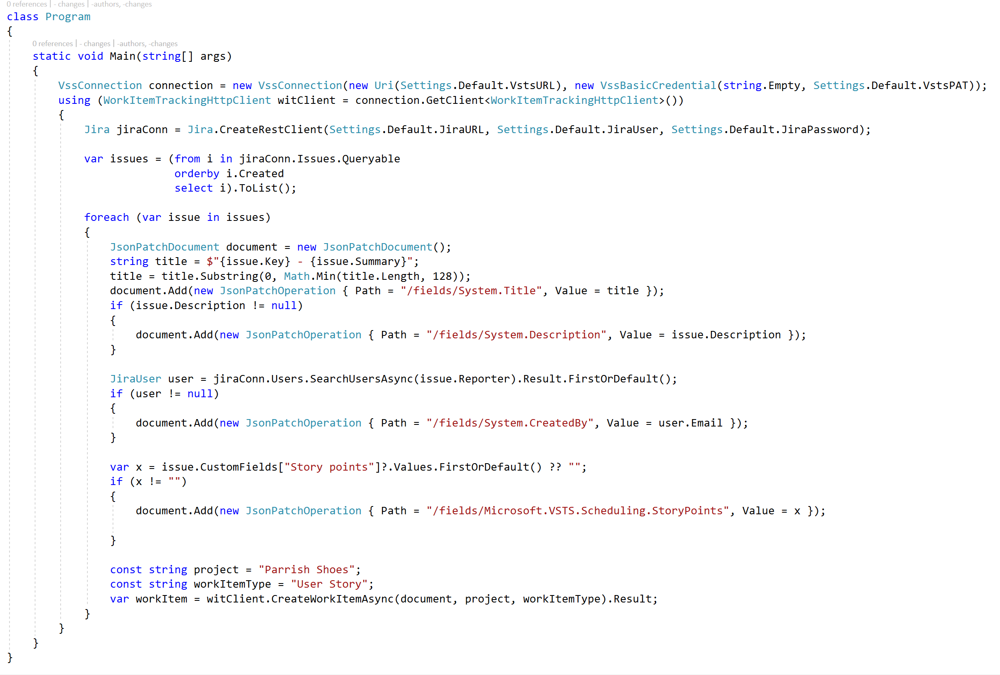

# JiraToVsts

Simple console app to demonstrate how to import Jira issues into VSTS work items.

This work is inspired by the research of [ALM Rangers](https://blogs.msdn.microsoft.com/visualstudioalmrangers/2017/01/16/importing-from-jira-to-vsts/).

